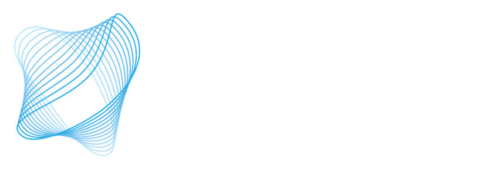

<!-- Header -->
@@jumbotron,jumbotron-fluid,no-pad
  @@container
    ~~~
    
    <h2>Quantum Information Science  at UMass Amherst</h2>
    A cross-departamental institute including researchers from  Computer Science, Engineering, and Physics.
    ~~~

    @@buttons
      ~~~
      ~~~
    @@
  @@
@@

@@features
  @@container
    @@row
      @@col-md-12,feature-title
        ~~~
        <h2>Research Groups</h2>
        ~~~
        Work at UMass Amherst spans a wide range of activities, from theory of computation and networking to building the actual quantum hardware.
      @@
    @@
    @@row
      @@col-md,feature
        ~~~
        <h5>Low-level Hardware Abstraction <a href="https://lab.krastanov.org/">Stefan Krastanov, CS & Physics</a></h5>
        ~~~
        We work on the design, control, and optimization of quantum hardware for computation and networking, from its analog physical description up to the compilation of error-corrected logical circuitry running on it. Our research centers around leaky abstraction boundaries between the many layers of technologies making up the field of quantum computing and quantum information science.
      @@
      @@col-md,feature
        ~~~
        <h5>Trapped Ions and Photonics <a href="https://websites.umass.edu/rniffenegger/">Robert Niffenegger, Engineering</a></h5>
        ~~~
        The UMass+ Trapped Ions and Photonics lab develops integrated technologies like photonics for trapped ion QPUs. Developing trapped ion QPUs with integrated photonics may enable the next generation of quantum hardware towards large scale quantum computers and portable operation of quantum sensors like optical clocks.
      @@
      @@col-md,feature
        ~~~
        <h5>Superconducting Circuit Devices <a href="https://websites.umass.edu/wangc/">Chen Wang, Physics</a></h5>
        ~~~
        We work in the field of superconducting circuit devices for quantum information processing, with a focus on improving the performance of superconducting quantum bits (qubits) on both the physical and the (error-corrected) logical level. 
      @@
    @@
    @@row
      @@col-md,feature
        ~~~
        <h5>Quantum Network Control <a href="https://qutech.nl/lab/vardoyangroup/">Gayane Vardoyan, CS</a></h5>
        ~~~
        One focus of the group is to develop efficient entanglement distribution algorithms, often inspired both by analytical models of quantum network architectures, as well as techniques found in classical networking literature. In general, the group is interested in addressing the many challenges pertaining to distributed quantum systems, as well as seeking new quantum-enabled possibilities and applications.git 
      @@
      @@col-md,feature
      @@
      @@col-md,feature
      @@
    @@
  @@
@@

@@friends
  @@container
    @@row
      @@col-md-12,feature-title
        ~~~
        <h2>Sponsors and Partners</h2>
        ~~~
      @@
    @@

    @@row
      @@col-md
        ~~~
        
        ~~~
      @@
      @@col-md
        ~~~
        
        ~~~
      @@
      @@col-md
        ~~~
        
        ~~~
      @@
    @@

  @@
@@
